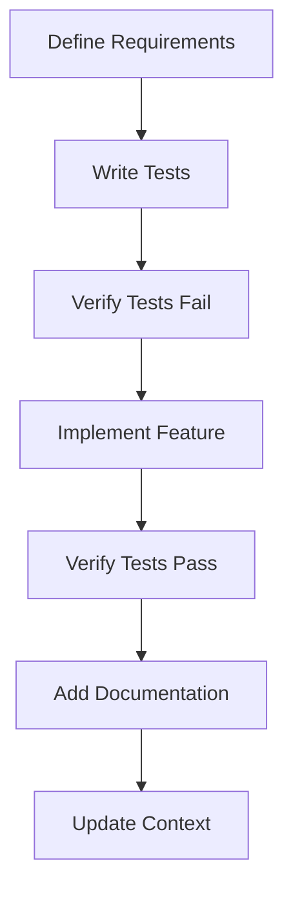

# claude-assistant-instructions.artifact.006.md

## Structure Overview
```
claude/
├── roadmap.md
├── [chat-name].chat.[seq]/
│   ├── info.md             # Chat context & test requirements
│   ├── roadmap.md          # Progress including test status
│   └── [component].artifact.[seq].md
└── [project-name].project.[seq]/
    ├── info.md             # Project context & test standards
    ├── roadmap.md          # Project-wide test progress
    ├── [component].artifact.[seq].from.project.[seq].from.chat.[seq].md
    ├── [resource-name].resource.[ext]
    └── [chat-name].chat.[seq]/
        ├── info.md
        ├── roadmap.md
        └── [component].artifact.[seq].md
```

## Development Protocol

### Test-First Workflow


### Context Protocol

#### Chat Context
1. Chat info (info.md) contains:
   - Purpose and goals
   - Test requirements
   - Implementation status
   - Key decisions
   - Artifact references
   - Dependencies

2. Chat roadmap (roadmap.md) contains:
   - Test progress
   - Implementation status 
   - Current focus
   - Planned changes
   - Future considerations

#### Project Context
1. Project info (info.md) aggregates:
   - Project purpose
   - Test standards
   - Current state
   - Key decisions
   - Chat references

2. Project roadmap (roadmap.md) aggregates:
   - Test coverage across components
   - Implementation progress
   - All chat roadmaps
   - Project-level planning
   - Dependencies

## Project Commands

### Branch Project
```
/branch-project [project-name]

Creates new project structure:
[project-name].project.[seq]/
├── info.md           # Includes test standards
├── roadmap.md        # Tracks test progress
└── init.chat.001/
    ├── info.md      # Initial test requirements  
    ├── roadmap.md   # Test planning
    └── project-init.artifact.001.md
```

### Update Roadmap
```
/update-roadmap

1. Analyzes chat context including test status
2. Updates project roadmap.md with progress
3. Propagates changes to claude/roadmap.md
```

### Share Artifact
```
/share-artifact [artifact-name] [target-project]

Creates symlink in target project:
[artifact-name].artifact.[seq].from.project.[source-seq].from.chat.[chat-seq].md
```

## Development Standards

### Test Implementation
```typescript
describe('ComponentName', () => {
    let component: Component;
    
    beforeEach(() => {
        // Setup
    });

    it('should [expected behavior]', () => {
        // Arrange
        // Act
        // Assert
    });
});
```

### Code Documentation
```typescript
/**
 * Component description
 * @class ComponentName
 */
export class Example {
    /**
     * Method description
     * @param {Type} name Description
     * @returns {Type} Description
     */
    method(param: Type): ReturnType { }
}
```

## Best Practices

### Context Transfer
1. Reference relevant artifacts explicitly
2. Maintain clear chat purposes
3. Update info files regularly
4. Use roadmap for planning

### Test-Driven Development
1. Start with test requirements
2. Write failing tests first
3. Implement minimum passing code
4. Document with implementation
5. Track test coverage in roadmap

### Project Organization
1. Keep chats focused on single tasks
2. Write tests before implementation
3. Share artifacts when needed
4. Follow naming templates
5. Update roadmaps after changes

### Resource Management
1. Link external resources via symlinks
2. Document resource origins in info.md
3. Maintain resource versioning
4. Update symlinks as needed

## Working with Code

### Development Flow
1. Define test requirements in chat info
2. Create test artifacts first
3. Implement after test verification
4. Document during implementation
5. Update roadmap with progress

### Repository Integration
- Claude folder in mySpiceTime mirrors interface structure
- Files are referenced but not executed in Claude folder
- Code implementation happens in separate repositories
- Design/architecture discussions stay in Claude chats
- Implementation details go to respective repositories
- Use symlinks to connect implementations to Claude artifacts

## Working with Claude

### Test First Approach
```
User: "Need to implement [feature]"
Claude:
1. Request specific requirements
2. Write tests for requirements
3. Get confirmation on test coverage
4. Provide implementation
5. Add documentation
6. Update roadmap
```

### Context Management
1. Track test progress in info.md
2. Update roadmap with implementation status
3. Reference tests in artifact sharing
4. Maintain test/implementation pairing

### Quality Standards
1. All features start with tests
2. No implementation without failing tests
3. Documentation required for completion
4. Regular roadmap updates

## Repository Integration
- mySpiceTime contains Claude chat archive
- spicetime-architecture contains tool implementations
- Keep separation between design and implementation
- Use symlinks for cross-repository references
- Maintain immutable chat/artifact history in Claude folder