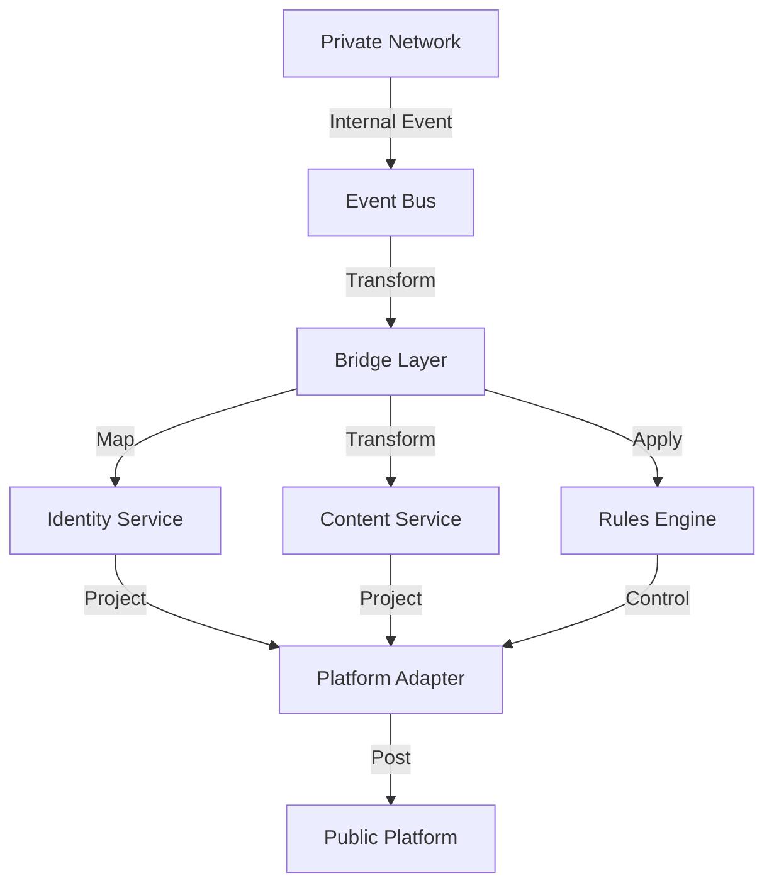

# Technical Specification: Dual-Network System Implementation

## 1. System Architecture

### 1.1 Core Components

```
├── Private Network Core
│   ├── Identity Service
│   ├── Content Store
│   ├── Group Manager
│   └── Access Control
├── Bridge Layer
│   ├── Identity Mapper
│   ├── Content Transformer
│   ├── State Manager
│   └── Rules Engine
└── Platform Adapters
    ├── Telegram Adapter
    ├── Facebook Adapter
    └── Generic Social Adapter
```

### 1.2 Data Flow Architecture



## 2. Component Specifications

### 2.1 Identity Service

#### 2.1.1 Core Interfaces

```typescript
interface IdentityMapping {
    internalId: string;
    externalIds: Map<PlatformType, string>;
    mappingRules: MappingRule[];
    privacyLevel: PrivacyLevel;
    metadata: Record<string, any>;
}

interface MappingRule {
    platform: PlatformType;
    transformations: TransformationRule[];
    exposureLevel: ExposureLevel;
    contextRules: ContextRule[];
}

enum PrivacyLevel {
    PRIVATE = 'PRIVATE',
    INTERNAL = 'INTERNAL',
    RESTRICTED = 'RESTRICTED',
    PUBLIC = 'PUBLIC'
}
```

#### 2.1.2 Implementation

```typescript
class IdentityManager {
    private mappings: Map<string, IdentityMapping>;
    private platformAdapters: Map<PlatformType, PlatformAdapter>;

    async mapIdentity(internalId: string, platform: PlatformType): Promise<string> {
        const mapping = this.mappings.get(internalId);
        if (!mapping) throw new Error('Identity mapping not found');

        return this.applyMappingRules(mapping, platform);
    }

    private applyMappingRules(mapping: IdentityMapping, platform: PlatformType): string {
        const rules = mapping.mappingRules.filter(r => r.platform === platform);
        // Apply transformation rules
        return this.generatePlatformId(mapping, rules);
    }
}
```

### 2.2 Content Transformer

#### 2.2.1 Content Models

```typescript
interface InternalContent {
    id: string;
    author: string;
    content: ContentBody;
    metadata: ContentMetadata;
    permissions: Permission[];
    created: Date;
    modified: Date;
}

interface ContentBody {
    type: ContentType;
    data: any;
    attachments: Attachment[];
}

interface ExternalContent {
    id: string;
    platformId: string;
    authorId: string;
    content: string;
    preview: PreviewData;
    platformMetadata: Record<string, any>;
}
```

#### 2.2.2 Transformation Engine

```typescript
class ContentTransformer {
    private rules: TransformationRule[];
    private privacyEngine: PrivacyEngine;

    async transform(content: InternalContent, platform: PlatformType): Promise<ExternalContent> {
        const privacyLevel = await this.privacyEngine.assessContent(content);
        const applicableRules = this.rules.filter(r =>
            r.contentType === content.content.type &&
            r.privacyLevel >= privacyLevel
        );

        return this.applyTransformationRules(content, applicableRules, platform);
    }

    private async applyTransformationRules(
        content: InternalContent,
        rules: TransformationRule[],
        platform: PlatformType
    ): Promise<ExternalContent> {
        // Apply rules sequentially
        let transformedContent = content;
        for (const rule of rules) {
            transformedContent = await rule.apply(transformedContent);
        }

        return this.formatForPlatform(transformedContent, platform);
    }
}
```

### 2.3 Platform Adapter

#### 2.3.1 Base Adapter Interface

```typescript
interface PlatformAdapter {
    connect(): Promise<void>;

    disconnect(): Promise<void>;

    postContent(content: ExternalContent): Promise<string>;

    updateContent(id: string, content: ExternalContent): Promise<void>;

    deleteContent(id: string): Promise<void>;

    handleInteraction(interaction: PlatformInteraction): Promise<void>;
}
```

#### 2.3.2 Telegram Implementation

```typescript
class TelegramAdapter implements PlatformAdapter {
    private client: TelegramClient;
    private mappingService: IdentityMapper;
    private contentTransformer: ContentTransformer;

    async postContent(content: ExternalContent): Promise<string> {
        const telegramContent = await this.formatForTelegram(content);
        const response = await this.client.sendMessage({
            chat_id: this.getMappedChatId(content.authorId),
            text: telegramContent.text,
            entities: telegramContent.entities,
            reply_markup: this.createReplyMarkup(content)
        });

        return response.message_id.toString();
    }

    private async formatForTelegram(content: ExternalContent): Promise<TelegramMessage> {
        // Transform content to Telegram format
        // Handle markdown, entities, media, etc.
    }
}
```

### 2.4 Rules Engine

#### 2.4.1 Rule Definitions

```typescript
interface Rule {
    id: string;
    type: RuleType;
    conditions: Condition[];
    actions: Action[];
    priority: number;
}

interface Condition {
    field: string;
    operator: ConditionOperator;
    value: any;
}

interface Action {
    type: ActionType;
    parameters: Record<string, any>;
}
```

#### 2.4.2 Rule Processor

```typescript
class RulesEngine {
    private rules: Rule[];

    async processContent(content: InternalContent): Promise<ProcessingResult> {
        const applicableRules = this.findApplicableRules(content);
        const sortedRules = this.sortRulesByPriority(applicableRules);

        return this.applyRules(content, sortedRules);
    }

    private async applyRules(
        content: InternalContent,
        rules: Rule[]
    ): Promise<ProcessingResult> {
        let processedContent = content;
        const appliedActions: Action[] = [];

        for (const rule of rules) {
            if (await this.evaluateConditions(rule.conditions, processedContent)) {
                const result = await this.executeActions(rule.actions, processedContent);
                processedContent = result.content;
                appliedActions.push(...result.actions);
            }
        }

        return {content: processedContent, actions: appliedActions};
    }
}
```

## 3. Data Models

### 3.1 Internal Data Structures

```typescript
interface Organization {
    id: string;
    name: string;
    members: Member[];
    groups: Group[];
    policies: Policy[];
}

interface Member {
    id: string;
    identityMapping: IdentityMapping;
    roles: Role[];
    permissions: Permission[];
}

interface Group {
    id: string;
    name: string;
    type: GroupType;
    members: string[];  // Member IDs
    externalMappings: ExternalGroupMapping[];
}
```

### 3.2 External Data Structures

```typescript
interface PlatformContent {
    platformId: string;
    type: PlatformContentType;
    content: string;
    metadata: PlatformMetadata;
    author: PlatformAuthor;
}

interface PlatformAuthor {
    id: string;
    displayName: string;
    platformSpecific: Record<string, any>;
}
```

## 4. API Specifications

### 4.1 Internal API

```typescript
interface InternalAPI {
    // Identity Management
    createIdentity(member: Member): Promise<IdentityMapping>;

    updateIdentity(id: string, updates: Partial<Member>): Promise<void>;

    // Content Management
    createContent(content: InternalContent): Promise<string>;

    updateContent(id: string, content: Partial<InternalContent>): Promise<void>;

    // Group Management
    createGroup(group: Group): Promise<string>;

    addMemberToGroup(groupId: string, memberId: string): Promise<void>;
}
```

### 4.2 Platform API

```typescript
interface PlatformAPI {
    // Platform Operations
    post(content: PlatformContent): Promise<string>;

    update(id: string, content: Partial<PlatformContent>): Promise<void>;

    delete(id: string): Promise<void>;

    // Interaction Handling
    handleReaction(reaction: PlatformReaction): Promise<void>;

    handleComment(comment: PlatformComment): Promise<void>;
}
```

## 5. Security Considerations

### 5.1 Authentication

- Multi-factor authentication
- Role-based access control
- Session management
- Token-b