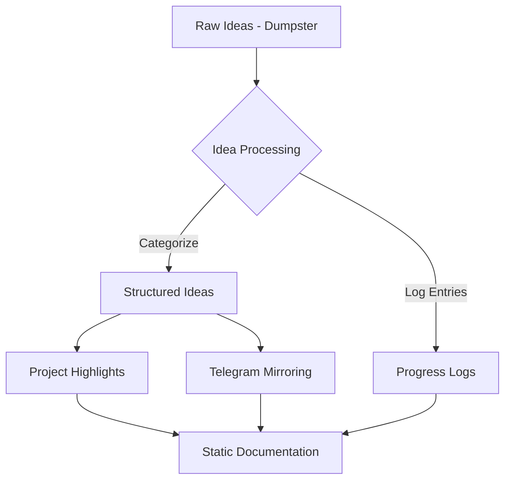

# Project Management System (PMS) Log (2023-11-02)

## Summary
This log focuses on the brainstorming, purpose, and future roadmap for the creation of a centralized **Project Management System**. It will serve as the cornerstone for all idea management workflows, logs, dumps, highlights, and documentation systems.

---

## Subjects

### 1. Purpose and Vision

**Accomplished:**
- Defined the need for a centralized Project Management System to:
  - Collect and organize ideas in various **states** (raw → structured → processed).
  - Maintain progress logs for projects and their major components (e.g., `Package Builder`, `Code Assistant`).
  - Enable **active collaboration** via Telegram or CLI for dumping and querying ideas dynamically.
  - Generate **static documentation** based on evolving highlights.

**Pending/Ideas:**
- Flesh out a full **workflow diagram** for how ideas will flow between:
  - Dumpsters → Logs → Actions → Outputs (Telegram, Docs, etc.).

---

### 2. Features to Implement

**Pending:**
- Core Storage System:
  - Leverage **MongoDB** or similar for centralized storage of ideas, logs, and processed data.
  - Define schemas to track:
    - Raw ideas from dumpsters.
    - Enriched and categorized ideas.
    - Logs and highlights tied to corresponding projects.
  - Establish revision histories for logs and ideas.

- Integration Planning:
  - Sync with Telegram for:
    - **Public visibility** of highlights and updates.
    - Interactive idea "dumping" and querying.
  - Automate the generation of static documentation on a website (via Gatsby or similar).

- Flexibility:
  - Allow for private vs. public visibility of ideas, highlights, and documentation.

---

### 3. Current Brainstormed Workflow

**Explanation:**
- **Raw Ideas - Dumpster:** Dump unstructured or quick ideas.
- **Idea Processing:** Cleanup and categorize ideas for structured storage.
- **Logs & Highlights:** Capture logs from processed ideas and generate highlights for updates.
- **Telegram Mirroring:** Push key highlights and project updates to Telegram for public interaction.
- **Static Documentation:** Generate and update the documentation site with structured highlights and logs.

---

### 4. Tools/Packages Under Consideration

**Pending/Ideas:**
- **Database**:
  - MongoDB (existing experience) or SQLite for lightweight storage.
- **Telegram Integration**:
  - Use Telegram Bot API for live updates and interactive dumping.
  - Tooling ideas: `node-telegram-bot-api` for interactivity.
- **Static Docs**:
  - Retain **Gatsby.js** as the generator for discovery docs.
  - Automate builds triggered by changes in Telegram or database logs.
- **CLI Tooling**:
  - Develop a CLI to interact with the PMS (add/log notes, generate reports directly).

---

### 5. Next Steps

**Immediate Tasks:**
1. Draft a schema for centralized storage of ideas/logs (raw, processed, archived).
2. Create a basic Telegram bot with input/output features for note/idea management.
3. Set up simple MongoDB storage for storing ideas and logs.
4. Investigate tools for auto-syncing Telegram data with a documentation site.

---

## Final Notes
The **Project Management System (PMS)** represents a crucial step in organizing and evolving all aspects of idea and progress tracking. By integrating with Telegram and generating static, updated docs, this system can bridge collaborative and archival workflows seamlessly. Key challenges lie in schema design, tool integration, and flexibility for public/private output.

---