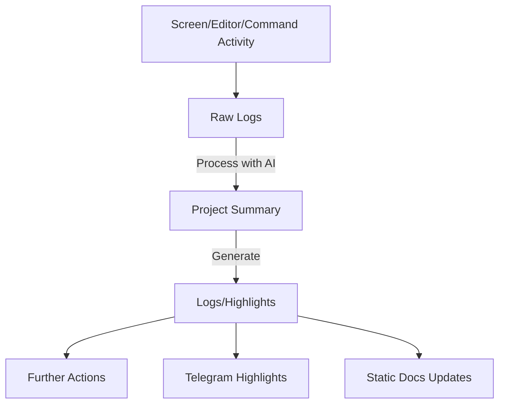

# Idea Dumpster (2023-11-02)

---

## **AI-Powered Automated Activity Logger**

### Summary
A system to monitor developer activity (screen, editor, commands, files) and use AI to generate structured project logs, suggestions, and milestones automatically. This would reduce effort in manually maintaining updates while providing intelligent next steps and centralizing project management into a generative agent.

---

### **Details and Thought Process**

#### **1. Purpose**
- Developers often lose track of the incremental work they do across projects during a day. 
- Generating structured updates manually (e.g., logs, to-dos, new ideas) adds cognitive load.
- This system automates:
  - **Activity tracking.**
  - **Summarization and suggestion creation** using AI.
  - Updates into logs, reminders, Telegram highlights, and static documentation.

---

#### **2. Core Features**

1. **Activity Monitoring**
   - Log filesystem changes (e.g., new files, edits, deletions).
   - Capture IDE operations: files opened, debugging sessions, builds.
   - Log terminal commands like `git`, `pnpm`, or anything custom.
   - Track interactions with research tools (e.g., websites accessed, code snippets copied).

2. **AI Context Processing**
   - Use AI/LLMs like GPT-4 for:
     - Summarizing recent activity into high-level project updates.
     - Identifying related next steps or tasks based on work patterns.
     - Highlighting potential project ideas from indirect actions (e.g., "You seem to be researching package builders. Create a task for that.").

3. **Integration & Automation**
   - Automatically build:
     - **Logs**: Chronological Markdown entries (aligned with your naming convention like `project-name-log.YYYY-MM-DD.md`).
     - **Reminders**: AI-powered task suggestions turned into actionable items pushed to Telegram.
     - **Highlights**: Condense daily/weekly activity into shareable updates, sync with a doc site or repository.
   - Mirror state with PMS and Telegram workflows for visibility.

---

#### **3. Brainstormed Workflow**

- **Screen/Editor/Command Activity:** Monitored through tools like chokidar, IDE integrations, or terminal hooks.
- **Raw Logs:** Unfiltered data stored temporarily (e.g., `File edited: src/index.ts`).
- **Project Summary:** AI processes raw logs and generates contextual updates (e.g., "Implemented API endpoints for Gateway. Add tests.").
- **Outputs:**
  - Logs: Markdown files for project history.
  - Highlights: Telegram messages or task updates.
  - Static Docs Updates: Build new documentation components automatically.

---

#### **4. Tech & Toolchain**

1. **Activity Monitoring**
   - **Filesystem**: Use `chokidar` or similar Node.js libraries to track changes.
   - **IDE Extensions**: JetBrains IDE plugins, VS Code APIs, or logs from editors.
   - **Command-Line Hooks**: Parse history of terminal commands (e.g., `bashrc`/`zshrc`).

2. **AI Contextualization**
   - Tools/Models:
     - LLM APIs: OpenAI, Anthropic, etc.
     - Local inference: Fine-tuned smaller models for privacy/local performance.
   - Convert raw logs into:
     - Work summaries.
     - Suggested next actions or tasks.

3. **Outputs**
   - **Logs**: Append updates to Markdown files like `project-name-log.YYYY-MM-DD.md`.
   - **Integration**:
     - Push suggestions to Telegram bots for public highlights.
     - Sync finished logs to PMS or doc generator.

---

#### **5. Immediate Challenges**
- **Granularity/Privacy**:
  - Filter out overly raw/irrelevant data (e.g., skipping debugging noise or unrelated commands).
  - Avoid compromising sensitive activities (e.g., private files or non-work tasks).
  - Allow customization of which activities to track.
- **AI Use**:
  - Prevent misinterpretations or vague summaries from turning into irrelevant next steps.
- **Integration**:
  - Build seamless flows across monitoring → AI → output.

---

#### **6. Potential Impact**
- **Save Time**:
  - No manual log creation—AI intelligently fills the gaps.
- **Cognition Aid**:
  - Constant reminders of what’s happening in each project without needing to rely on memory.
- **Automation**:
  - Logs, tasks, and documentation auto-generated, synced wherever needed.

---

#### **7. Long-Term Vision**
- Integrate this logger directly into the **PMS generative agent** for a complete, self-updating project management experience.
- Expand capabilities to:
  - Manage and visualize project timelines dynamically.
  - Expose developer progress publicly (if configured) via shared mediums like Telegram and the doc site.

---

### **Next Steps**
- Experiment with a basic filesystem monitoring prototype.
- Draft a schema for raw activity logs and AI-processed summaries.
- Test AI contextualization for converting logs into meaningful updates.
- Align generated outputs (logs, tasks, highlights) with your ongoing **PMS design.**

---

## Final Notes
This idea is an incredible foundational piece for building a **true generative agent** capable of both understanding and evolving your projects as you work. By centralizing updates, extending them to Telegram/public systems, and creating intelligent suggestions, this could revolutionize your productivity.

---