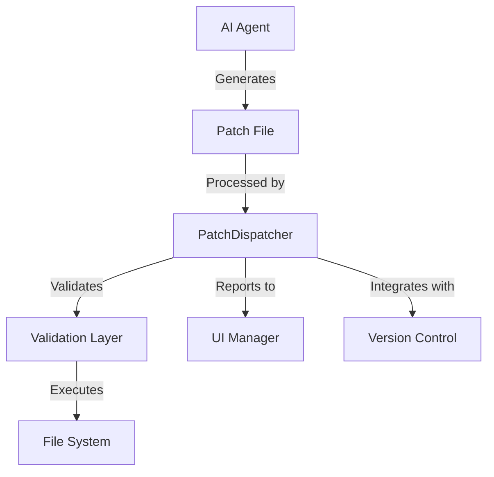
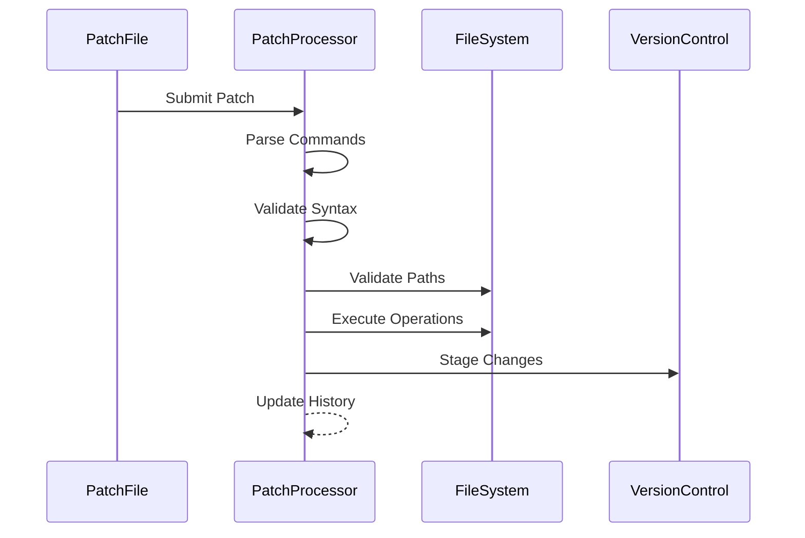
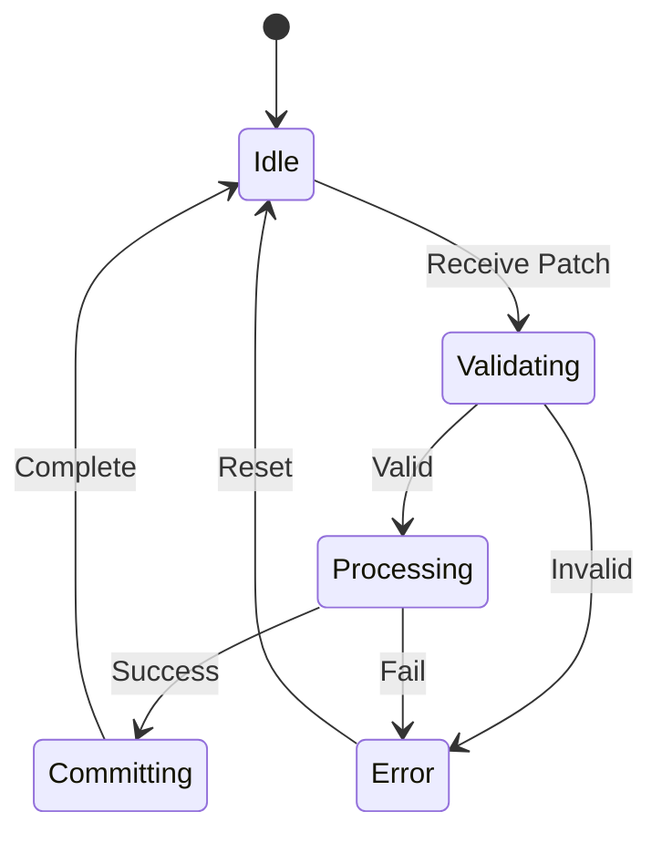

# PatchDispatcher Design Document

## System Context
PatchDispatcher is a core component of SpiceTime's self-modifying architecture, enabling controlled repository mutations through a standardized patch format. It bridges AI-driven suggestions with actual codebase changes.

### Position in Architecture


### Core Responsibilities
1. Patch Processing
    - Parse standardized patch format
    - Validate operations
    - Execute file system changes
    - Maintain operation atomicity

2. Integration Points
    - Version Control System
    - File System Abstraction
    - UI Event System
    - AI Agent Communication

## Technical Architecture

### Command Pipeline


### File System Abstraction
```typescript
interface FileSystemOperations {
  readFile: (path: string) => Promise<string>;
  writeFile: (path: string, content: string) => Promise<void>;
  exists: (path: string) => Promise<boolean>;
  mkdir: (path: string) => Promise<void>;
}
```

This abstraction enables:
- Local/Remote operation switching
- Testing isolation
- Platform independence
- Custom implementations

### Patch Format Specification
```
/* COMMAND [type] PATH [filepath] */
[content]
/* COMMAND [type] END*/
```

Where:
- type: INSERT | DELETE | UPSERT | REVERT
- filepath: Relative path from repository root
- content: File content for INSERT/UPSERT operations

## Implementation Details

### Error Handling Strategy
1. Validation Errors
    - Line number reference
    - Specific error messages
    - Recovery suggestions

2. Execution Errors
    - Operation rollback
    - State consistency
    - Detailed error reporting

### State Management


### Safety Mechanisms
1. Path Validation
    - Repository boundary checks
    - Directory traversal prevention
    - Path normalization

2. Content Safety
    - File size limits
    - Content validation
    - Format verification

3. Operation Atomicity
    - Transaction-like behavior
    - Rollback capabilities
    - State consistency

## Usage Patterns

### React Component Integration
```typescript
<FileSystemContext.Provider value={fileSystem}>
  <PatchDispatcher
    onPatchComplete={handleComplete}
    onError={handleError}
  />
</FileSystemContext.Provider>
```

### CLI Operation
```bash
pnpm patch <patchfile>
```

### Programmatic Usage
```typescript
const processor = new PatchProcessor(fileSystem);
const result = await processor.processContent(patchContent);
```

## Future Extensions

### Planned Features
1. Pattern Recognition
    - Learn from successful patches
    - Suggest optimizations
    - Detect common patterns

2. Advanced Validation
    - AST-based parsing
    - Semantic analysis
    - Impact prediction

3. CI/CD Integration
    - Pipeline hooks
    - Automated testing
    - Documentation updates